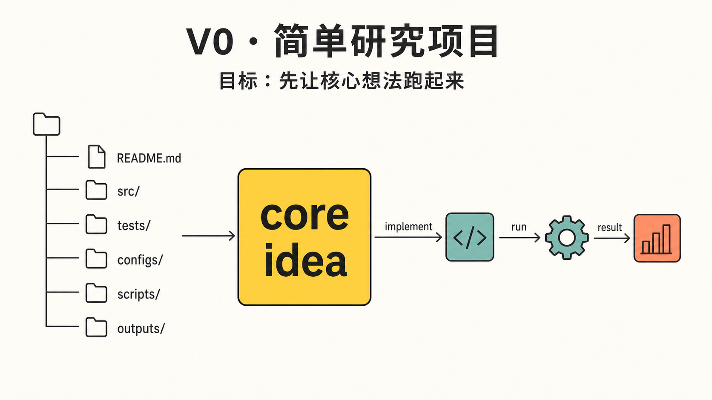
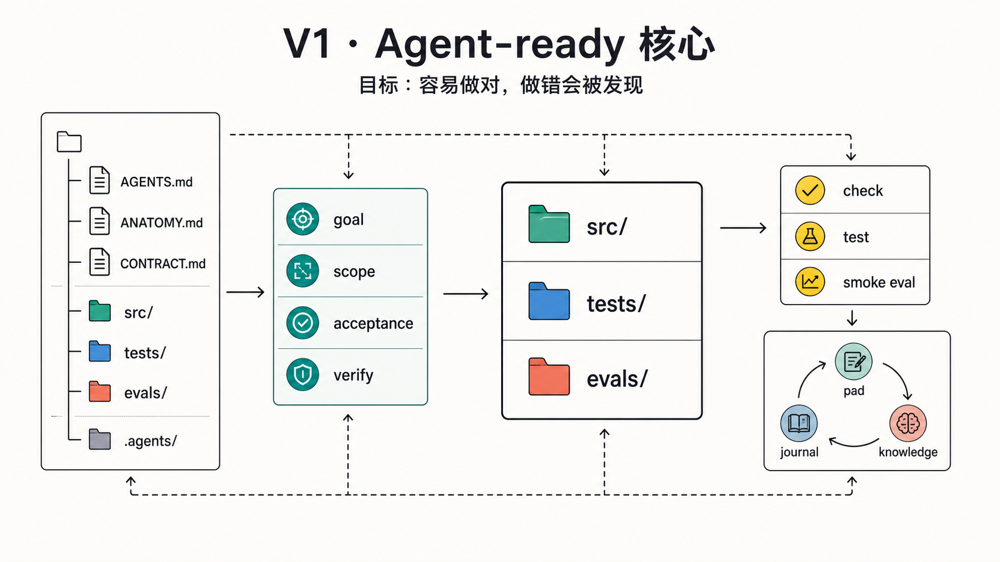
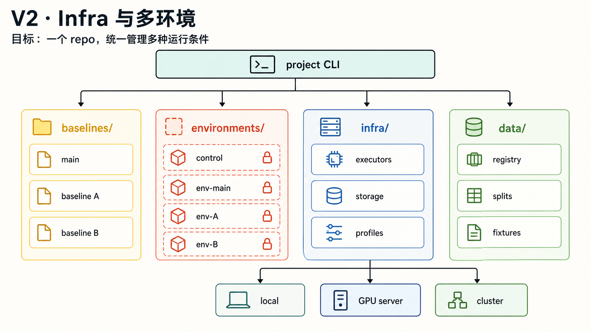
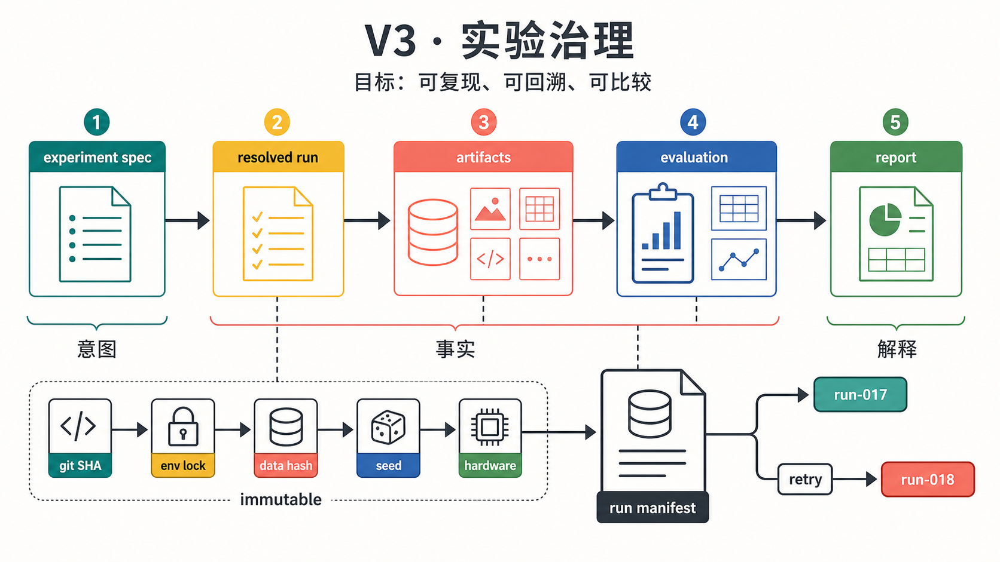
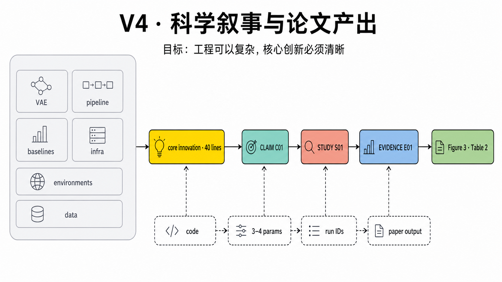
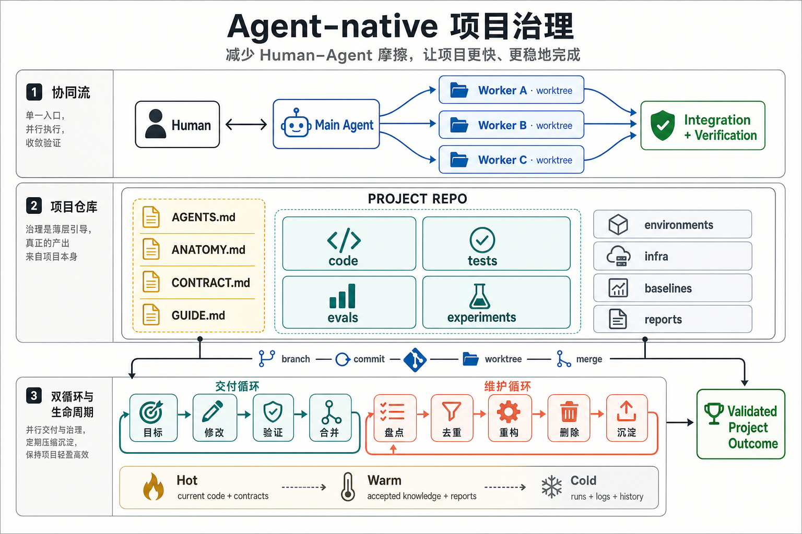

# Repository Evolution

These diagrams show changes in emphasis, not a sequence where earlier versions lack necessary
execution support. Even the first useful project state must close the loop across contribution,
existing substrate, environment, data, executor, and evaluation.

The stable logical model is:

```text
contribution + substrate + execution context + evaluation = reproducible result
```

These project-producing surfaces form the functional project. The governance sidecar observes
them through public interfaces and supplies orientation, constraints, coordination, validation,
and maintenance without becoming a dependency of the result.

Physical structure grows when an object becomes plural, shared, expensive, or independently
versioned.

The interactive [current repository map](repository-map.html) labels the concrete template
paths as governance or functional. The diagrams below describe how those paths become necessary
over time rather than replacing that ownership map.

## V0: One Complete Vertical Slice



The implementation surface is small and the core idea is easy to see. This picture intentionally
compresses supporting infrastructure. In a real repository, the first slice still pins its
existing implementation, environment, data, executor, and smoke evaluation.

At this stage, a singleton may remain inline:

```text
environment.lock
infra.yaml
experiment.yaml
```

## V1: Agent-Ready Core



The repository gains a thin `.agents/` sidecar and an executable project feedback loop:

- bounded tasks;
- code, tests, and evaluations;
- short-lived pad and journal;
- reviewed durable knowledge.

This stage reduces repeated orientation and explanation. Governance remains physically
contained and smaller than the project surface it guides.

## V2: Infrastructure And Multiple Environments



Singleton descriptions become explicit collections only after the project gains incompatible
workloads, external baselines, multiple executors, or shared data:

```text
environment.lock -> environments/<id>/
infra.yaml        -> infra/profiles/ + executors/ + storage/
source.lock       -> baselines/<id>/
```

A stable command surface resolves logical names into runtime-specific values. Experiments do not
scatter server paths or merge incompatible dependencies into one environment.

## V3: Experiment Governance



As runs become expensive, parallel, or citable, the repository separates:

```text
experiment spec -> resolved run -> artifacts -> evaluation -> report
```

The spec is intent, the run manifest is fact, and the report is interpretation. Retries create
new immutable runs instead of overwriting history.

## V4: Scientific Narrative And Publication



Engineering complexity can grow while the contribution remains visible. A contribution index
links the small innovation surface to its parameters, controlled substrate, run IDs, evidence,
and publication outputs.

Raw runs remain available for audit, but papers and human-facing reports consume curated,
traceable evidence rather than terminal logs or copied metrics.

## The Governing Loop



The default path keeps the human in one conversation with a main agent, which coordinates
isolated worktree agents and integrates their output. When more conversational parallelism or
lower-latency steering matters, the human may directly control selected worktree agents. Both
modes can coexist, and either human or main agent may create or adopt the worktrees.

Delivery advances the project; bounded maintenance periodically removes duplicate code, stale
docs, obsolete memory, and unreferenced outputs.

The template should evolve only when a repeated project cost justifies a new permanent mechanism.
